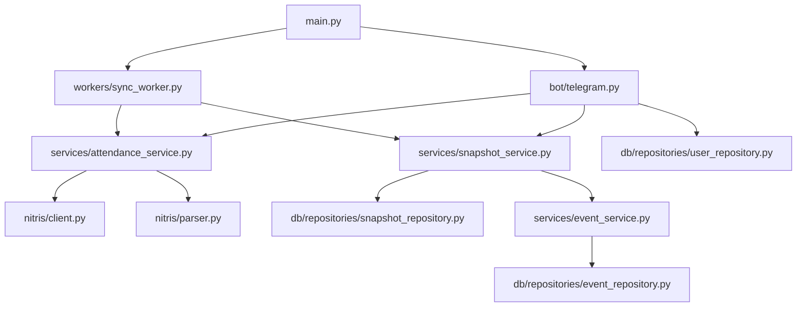
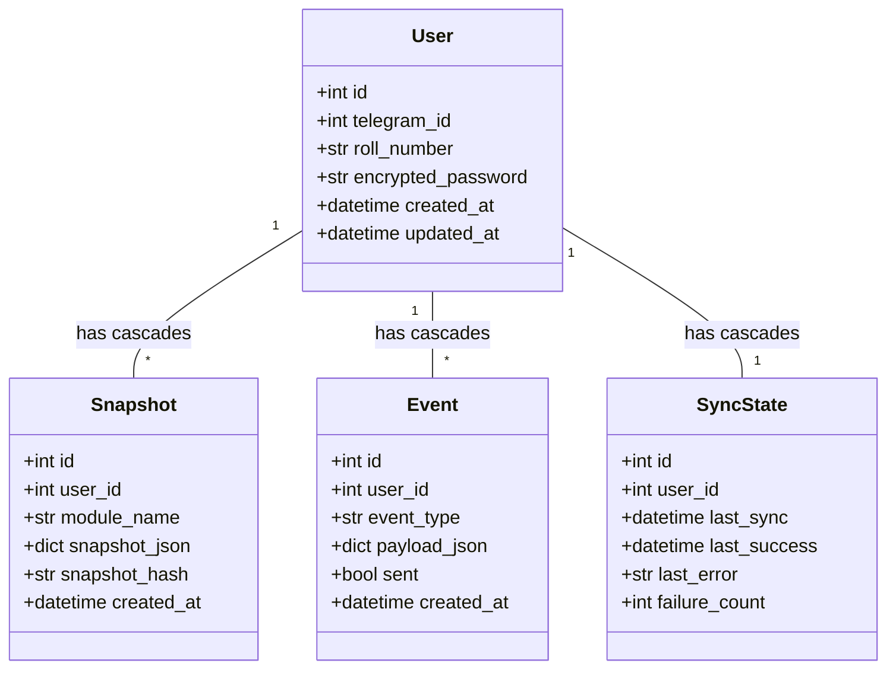

# Architecture Report: CollegeClaw / NITRISClaw

This report provides a comprehensive architectural review of the CollegeClaw repository, mapping the layout, dependencies, flows, strengths, weaknesses, and security or scaling concerns.

---

## 1. Directory Tree

```
collegeclaw/
├── alembic/                      # Database migrations
│   ├── versions/
│   │   ├── 001_initial_schema.py
│   │   └── 4ffd79a4db9f_add_sync_states_table.py
│   ├── env.py
│   └── script.py.mako
├── app/
│   ├── bot/
│   │   └── telegram.py           # Telegram aiogram bot interface and handlers
│   ├── db/
│   │   ├── repositories/
│   │   │   ├── event_repository.py
│   │   │   ├── snapshot_repository.py
│   │   │   └── user_repository.py
│   │   ├── crypto.py             # Fernet symmetric encryption & password rotation utilities
│   │   ├── database.py           # SQLAlchemy async engine, sessionmaker, and session context
│   │   └── models.py             # Declarative SQLAlchemy models (User, Snapshot, Event, SyncState)
│   ├── nitris/
│   │   ├── aspnet.py             # ASP.NET WebForms postback & viewstate handling
│   │   ├── client.py             # Persistent httpx-based NITRIS portal client
│   │   ├── constants.py          # Portal selectors, endpoints, and headers
│   │   ├── exceptions.py         # Domain-specific exception definitions
│   │   └── parser.py             # BeautifulSoup attendance table parser
│   ├── services/
│   │   ├── attendance_service.py # Core orchestration layer for attendance fetching
│   │   ├── event_service.py      # Semantic diff engine for detecting differences between snapshots
│   │   └── snapshot_service.py   # Snapshot hashing and persistence orchestration
│   ├── workers/
│   │   └── sync_worker.py        # Background synchronization and dispatcher loops
│   ├── config.py                 # Application configuration from environment variables
│   └── main.py                   # System entry point
├── debug_html/                   # Saved HTML page copies (gitignored / runtime debugging)
├── scratch/                      # Diagnostic and verification scripts
├── alembic.ini                   # Alembic configuration
├── architecture.md               # Core system architecture principles
├── current_phase.md              # Current project goals and scopes
├── requirements.txt              # Project package dependencies
└── soul.md                       # Core project soul and development guidelines
```

---

## 2. Service Dependencies



---

## 3. Database Model Relationships



* **Cascades**: All foreign keys to the `User` model (`snapshots.user_id`, `events.user_id`, `sync_states.user_id`) are defined with `ondelete="CASCADE"`, mapped via SQLAlchemy relationships with `cascade="all, delete-orphan"`.
* **JSONB Columns**: `snapshots.snapshot_json` and `events.payload_json` utilize PostgreSQL-native `JSONB` columns, enabling optimized storage and high-speed indexing.
* **Indexes**: Explicit single columns indexes exist on `User.roll_number`, `Snapshot.snapshot_hash`, and `Event.sent`. Specific composite indexes include:
  * `idx_snapshots_user_module` on `(user_id, module_name)`
  * `idx_events_user_sent` on `(user_id, sent)`

---

## 4. Workflows & Architecture Flows

### A. Telegram Flow
1. User invokes `/start` -> Bot requests roll number -> sets state `waiting_for_roll`.
2. User provides roll number -> Bot stores roll number in session FSM -> requests password -> sets state `waiting_for_password`.
3. User enters password -> Bot intercepts password, encrypts it symmetrically via `crypto.py`, persists user credentials inside the `users` table, and clears FSM states.
4. User invokes `/attendance` -> Bot retrieves user row, decrypts password -> triggers `get_attendance_data()` -> if data changes, updates snapshot and triggers event system -> formats and replies with attendance status to the user.

### B. Snapshot & Event Flow
1. Fetch latest attendance data from NITRIS portal.
2. Serialize attendance to a sorted-key JSON string -> generate SHA-256 hash.
3. Fetch the latest snapshot for the user.
4. If hash is identical, skip snapshot creation.
5. If hash differs:
   - Persist the new snapshot.
   - Run semantic comparison with previous snapshot (if any).
   - If no previous snapshot exists (first sync), record `new_subject_added` events for all subjects.
   - If previous snapshot exists, compare record fields `tc`, `ua`, `le`, `oa`. If changes are found, emit `attendance_updated` events. If `ua` (unauthorized absence) increased, also emit `new_absence_detected` events.

### C. Worker Architecture
* **Sync Worker**: Periodically queries all registered users from the database, builds a queue of synchronous jobs, and concurrency-throttles them utilizing an `asyncio.Semaphore` (max concurrency: 10). Failed user sync cycles write errors to `sync_states` table for observability but do not block other threads.
* **Dispatch Worker**: Periodically checks for unsent events (`sent == False`) up to a batch size of 50. For each event, it formats a highly aesthetic HTML message, sends it via Telegram, and updates the event's `sent` column to `True` under isolated database transactions.

---

## 5. Strengths & Weaknesses

### Strengths
1. **Clean Separation of Concerns**: Scraper, parser, database models, repositories, business services, background workers, and Telegram presentation layers are kept completely separate.
2. **Robust Multi-Step Scraping**: The ASP.NET postback navigation mechanism correctly mimics browser submissions, extracting state fields (`__VIEWSTATE`, `__EVENTVALIDATION`), sorting academic years, and auto-probing active semester sessions.
3. **Deterministic Snapshot Hashing**: Use of SHA-256 hashing on key-sorted JSON prevents duplicate snapshots and false change alerts.
4. **Resilient Persistence**: Connection pooling, pre-pinging, transaction context management, and automatic resource cleanups are configured correctly.

### Weaknesses
1. **Coupling Presentation to Persistence**: The Telegram handler layer directly imports and invokes repositories and Snapshot Services instead of routing requests strictly through service boundaries.
2. **Detached Entity Access**: Handlers fetch the `User` object, close the session, and later access simple properties on the detached user object. While safe for primitive types in standard setups, this risks `DetachedInstanceError`s if lazy attributes or relationships are accessed later.
3. **No Retries on Transient Login Failures**: In `attendance_service.py`, `NitrisClient.login()` runs once outside the retry loop. If a brief network hiccup interrupts the login handshake, the entire operation fails without retrying.
4. **Inefficient Dispatch Transactions**: The event dispatcher runs an independent single-record UPDATE transaction for every sent notification in the loop rather than compiling updates in a single bulk database transaction.
5. **No Event Taxonomy / Type Hints Safety**: Event types are raw strings (`"attendance_updated"`, `"new_absence_detected"`). A typo in these strings will cause silent operational failures.

---

## 6. Security & Scaling Concerns

### Security Concerns
1. **Plaintext Password Handling**: While passwords are encrypted at rest using Fernet, the decrypted password briefly exists in memory as a Python string during sync execution.
2. **Error Logging Exposures**: Improper exception handlers could write plaintext passwords or sensitive roll numbers to logs or Telegram messages during scraper failures.

### Scaling Concerns
1. **High Concurrency Database Contention**: As user counts expand, background worker semaphore concurrency (10 parallel users) coupled with Telegram `/attendance` user requests could exhaust connection pools if sessions are kept open too long.
2. **Linear Scraping Latency**: Each NITRIS sync requires 4 HTTP postbacks taking 2-6 seconds in total. Concurrency limits protect the target server but slow down the queue as the customer base scales.
