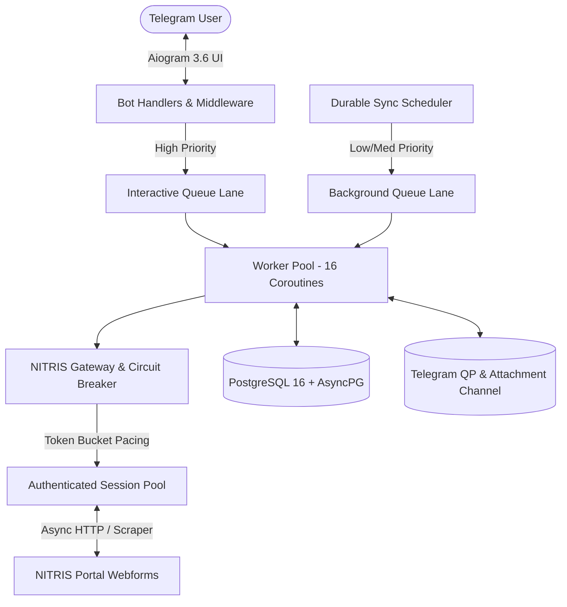

<div align="center">

# 🦀 NITRCLAW

### *Ultra-Fast, Resilient & Encrypted Telegram Companion for NIT Rourkela Students*

[](LICENSE)
[](https://www.python.org/)
[](https://github.com/aiogram/aiogram)
[](https://www.postgresql.org/)
[](#testing)
[](https://t.me/Nitrisclawbot)

<br/>

**Eliminate the daily friction of the legacy NITRIS portal.**  
Get real-time attendance alerts, upcoming class countdowns, campus notices with instant PDF downloads, and 1,900+ previous year question papers—all from a snappy, mobile-first Telegram bot.

👉 **Ready to use immediately:** [**@Nitrisclawbot on Telegram**](https://t.me/Nitrisclawbot)

---

</div>

## 📌 Table of Contents

- [Why NITRClaw?](#-why-nitrclaw)
- [Screenshots & Live UI](#-screenshots--live-ui)
- [Key Features](#-key-features)
- [Privacy & Security Guarantee](#-privacy--security-guarantee)
- [System Architecture](#-system-architecture)
- [Quick Start / Self-Hosting](#-quick-start--self-hosting)
  - [Method 1: Docker Compose (Recommended)](#method-1-docker-compose-recommended)
  - [Method 2: Manual Installation](#method-2-manual-installation)
- [Environment Configuration](#-environment-configuration)
- [Admin Commands & Observability](#-admin-commands--observability)
- [Testing](#-testing)
- [Contributing](#-contributing)
- [Disclaimer](#-disclaimer)
- [License](#-license)

---

## ⚡ Why NITRClaw?

The official NITRIS web portal is built on legacy ASP.NET webforms:
- ❌ Constant session timeouts, expired viewstates, and tedious logins.
- ❌ Heavy lag and frequent downtime during registration, midsem, and endsem periods.
- ❌ Clunky, non-responsive web design that is frustrating to navigate on mobile devices.
- ❌ Critical webmail notices get buried or missed.

**NITRClaw solves this with a modern, high-throughput asynchronous engine:**
- ✅ **Sub-second responses**: Cached-first UI backed by asynchronous background sync workers.
- ✅ **Zero portal overload**: Intelligent rate-limiting, token-bucket login pacing, and circuit breakers protect the NITRIS server from getting overwhelmed or banning IPs.
- ✅ **Direct document delivery**: Question papers and notice attachments are delivered as native Telegram documents without broken or expiring links.

---

## 📸 Screenshots & Live UI

<div align="center">

| Student Dashboard | System Telemetry (`/status`) | Admin Registration Alert |
| :---: | :---: | :---: |
|  |  |  |
| *Real-time attendance & timetable* | *Live gateway & worker health* | *Privacy-safe admin notifications* |

</div>

---

## ✨ Key Features

### 📊 Smart Attendance Tracker
* **Subject-Wise Breakdown**: View attended vs. total classes and your current attendance percentage per course.
* **Margin Calculators**: Automatically tells you how many classes you can afford to skip while staying $\ge 75\%$, or how many consecutive classes you need to attend to recover.
* **Instant Health Badges**: Clear status flags (🟢 `SAFE`, 🟡 `MARGIN`, 🔴 `CRITICAL`).

### ⏰ Now & Next / Timetable
* **Live Class Tracker**: See what lecture is currently ongoing and get an exact countdown to your next class.
* **Weekly Timetable Sync**: Automatically syncs your course schedule, class timings, and classroom locations.
* **Class-End Proactive Sync**: Triggers light background syncs when lectures conclude to keep records fresh.

### 📬 Campus Notices & Webmail Sync
* **Unread Counter**: See live unread counts directly in your main menu.
* **Full Body Reader**: Reads and cleans formatted HTML notice bodies without leaving Telegram.
* **Attachment Engine**: Downloads and caches notice attachments (PDFs, docs, circulars) in high-speed Telegram storage channels for immediate access.

### 📚 1,900+ Previous Year Question Papers (QP Hub)
* **Instant Search**: Search across Midsem and Endsem papers by subject code, semester, and academic year.
* **Prewarmed Caching**: Over 1,900+ past question papers are indexed and served via Telegram file IDs with zero portal load.

### 🛡️ Resilient Gateway & Job Queue
* **Token-Bucket Login Pacing**: Strict rate limiting prevents automated login bursts.
* **Circuit Breaker**: Automatically trips when NITRIS is undergoing maintenance or throwing 5xx errors, gracefully notifying students instead of hanging.
* **Dual-Lane Prioritization**: Interactive user button taps receive VIP worker lane priority over routine background synchronizations.

---

## 🔒 Privacy & Security Guarantee

We believe student privacy and trust must be 100% non-negotiable. NITRClaw is engineered from the ground up to guarantee strict data separation and confidentiality.

```
┌─────────────────────────────────────────────────────────────┐
│                    STUDENT DATA FLOW                        │
└─────────────────────────────────────────────────────────────┘
  Student (Telegram)
      │
      ▼  (Encrypted Transit)
  [NITRClaw Application Engine]
      │
      ├──▶ Encrypt Password (Fernet AES-128-CBC + HMAC-SHA256)
      │       │
      │       ▼
      │    [PostgreSQL Database] (Encrypted At Rest)
      │
      ├──▶ Fire-and-Forget Admin Notice:
      │       "🔔 New User: <Name> | Roll: <RollNumber>"
      │       (NO passwords, NO tokens, NO Telegram IDs sent)
      │
      └──▶ One-Tap Deregister ──▶ Permanent DB Hard Delete
```

1. **Encrypted at Rest**:
   * All NITRIS passwords are encrypted using **Fernet symmetric encryption (AES-128-CBC with HMAC-SHA256 authentication)** before saving to PostgreSQL.
   * Encryption keys are managed outside the database via environment variables (`ENCRYPTION_KEY`).
2. **Zero Password Access for Admins**:
   * Bot administrators **NEVER** receive, log, or have access to student passwords, session cookies, or Telegram chat IDs.
3. **Transparent Admin Notification**:
   * When a student registers, admins receive only a basic, transparent notification containing the student's **Name** and **Roll Number** (scraped from their own verified profile) to monitor registration load and prevent bot spam.
4. **Complete Data Sovereignty (Instant Deregister)**:
   * Tapping `❌ Deregister` or typing `/deregister` instantly and permanently deletes your account record, encrypted credentials, cached sessions, and snapshot history from the database.
5. **Open Source & Auditable**:
   * Every line of code is open source under the permissive MIT License. You are free to inspect, audit, or host the entire service yourself.

---

## 🏗️ System Architecture



---

## 🚀 Quick Start / Self-Hosting

You can easily run your own instance of NITRClaw on a VPS, local machine, or home server.

### Prerequisites
- **Python 3.11+** (if running bare-metal)
- **PostgreSQL 14+**
- A **Telegram Bot Token** from [@BotFather](https://t.me/Botfather)
- *(Optional)* A private Telegram channel for attachment/QP storage

---

### Method 1: Docker Compose (Recommended)

1. **Clone the repository:**
   ```bash
   git clone https://github.com/VORTEX-7rgb/UPDATEDNITR.git
   cd UPDATEDNITR
   ```

2. **Configure your environment file:**
   ```bash
   cp .env.example .env
   ```

3. **Generate a secure Fernet encryption key:**
   ```bash
   python -c "from cryptography.fernet import Fernet; print(Fernet.generate_key().decode())"
   ```
   Paste the generated string into `ENCRYPTION_KEY` inside `.env`.

4. **Fill in your credentials in `.env`:**
   ```ini
   BOT_TOKEN=your_telegram_bot_token
   ADMIN_TELEGRAM_IDS=your_telegram_user_id
   ENCRYPTION_KEY=your_generated_fernet_key
   ```

5. **Launch the stack:**
   ```bash
   docker-compose up -d --build
   ```

6. **Check logs:**
   ```bash
   docker-compose logs -f bot
   ```

---

### Method 2: Manual Installation

1. **Clone and create a virtual environment:**
   ```bash
   git clone https://github.com/VORTEX-7rgb/UPDATEDNITR.git
   cd UPDATEDNITR
   python -m venv .venv
   source .venv/bin/activate    # On Windows: .venv\Scripts\activate
   ```

2. **Install dependencies:**
   ```bash
   pip install -r requirements.txt
   ```

3. **Configure `.env`:**
   ```bash
   cp .env.example .env
   # Edit .env and supply BOT_TOKEN, ENCRYPTION_KEY, DATABASE_URL, etc.
   ```

4. **Run database migrations:**
   ```bash
   alembic upgrade head
   ```

5. *(Optional)* **Preload Question Paper index & attachment caches:**
   ```bash
   psql -d collegeclaw -f sync_cache.sql
   ```

6. **Start the bot:**
   ```bash
   python -m app.main
   ```

---

## ⚙️ Environment Configuration

All settings are configured via environment variables. See [`.env.example`](.env.example) for detailed defaults and descriptions.

| Variable | Description | Default |
| :--- | :--- | :--- |
| `BOT_TOKEN` | Telegram Bot API token from [@BotFather](https://t.me/Botfather) | *Required* |
| `ENCRYPTION_KEY` | 32-byte URL-safe base64 Fernet key for symmetric password encryption | *Required* |
| `DATABASE_URL` | Async PostgreSQL connection URI (`postgresql+asyncpg://...`) | *Required* |
| `ADMIN_TELEGRAM_IDS` | Comma-separated Telegram User IDs with admin access | `""` |
| `QP_STORAGE_CHAT_ID` | Telegram Channel ID for persistent PDF paper storage | `0` |
| `NITRIS_BASE_URL` | Base URL for the institute portal | `https://eapplication.nitrkl.ac.in` |
| `NITRIS_GATEWAY_MAX_CONCURRENT` | Maximum concurrent portal operations | `8` |
| `NITRIS_GATEWAY_MIN_LOGIN_INTERVAL` | Minimum interval (seconds) between login requests | `1.5` |
| `NITRIS_JOB_WORKERS` | Total asynchronous queue worker coroutines | `16` |
| `NITRIS_INTERACTIVE_WORKERS` | Dedicated worker lane for instant user button taps | `8` |
| `MODULE_TTL_ATTENDANCE` | Attendance background sync validity (seconds) | `43200` (12h) |
| `MODULE_TTL_INBOX` | Notice inbox background sync validity (seconds) | `14400` (4h) |
| `MODULE_TTL_TIMETABLE` | Timetable sync validity (seconds) | `604800` (7d) |

---

## 🛠️ Admin Commands & Observability

Authorized admin accounts (set via `ADMIN_TELEGRAM_IDS`) have access to specialized commands:

- `/status` — Live system telemetry dashboard:
  - **NITRIS Gateway**: Circuit state (`closed`/`open`), active requests, login pacing, average & p95 latencies, error counts.
  - **Job Queue**: Pending interactive vs background tasks, worker allocation, single-flight deduplication, and active handlers.
  - **Cache Stats**: Available cached question papers, lease status, and pending events.
- `/broadcast <message>` — Send critical campus-wide announcements to all active users with rate-paced delivery.
- `/prewarm` — Preload and cache question papers for specific semesters or subject codes.

---

## 🧪 Testing

NITRClaw features an exhaustive test suite of **354 automated tests** covering gateway concurrency, circuit breaker trip/recovery cycles, cryptographic encryption/decryption, HTML parsers, FSM transitions, and background event scheduling.

Run the test suite with:

```bash
pip install -r requirements-dev.txt
pytest
```

---

## 🤝 Contributing

Contributions from students and developers are warmly welcomed!

1. Fork the repository.
2. Create your feature branch (`git checkout -b feat/amazing-feature`).
3. Commit your changes (`git commit -m 'Add amazing feature'`).
4. Ensure all unit tests pass (`pytest`).
5. Push to the branch (`git push origin feat/amazing-feature`).
6. Open a Pull Request.

---

## ⚠️ Disclaimer

NITRClaw is an independent, open-source project created by students for the student community of the National Institute of Technology Rourkela (NITR). It is not officially endorsed by, directly affiliated with, or maintained by the institute administration.

---

## 📄 License

Distributed under the **MIT License**. See [`LICENSE`](LICENSE) for more information.
